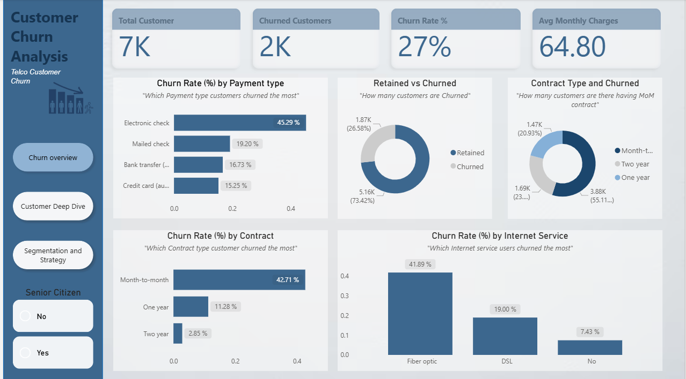
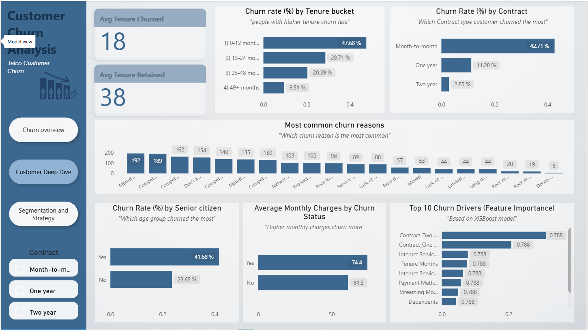
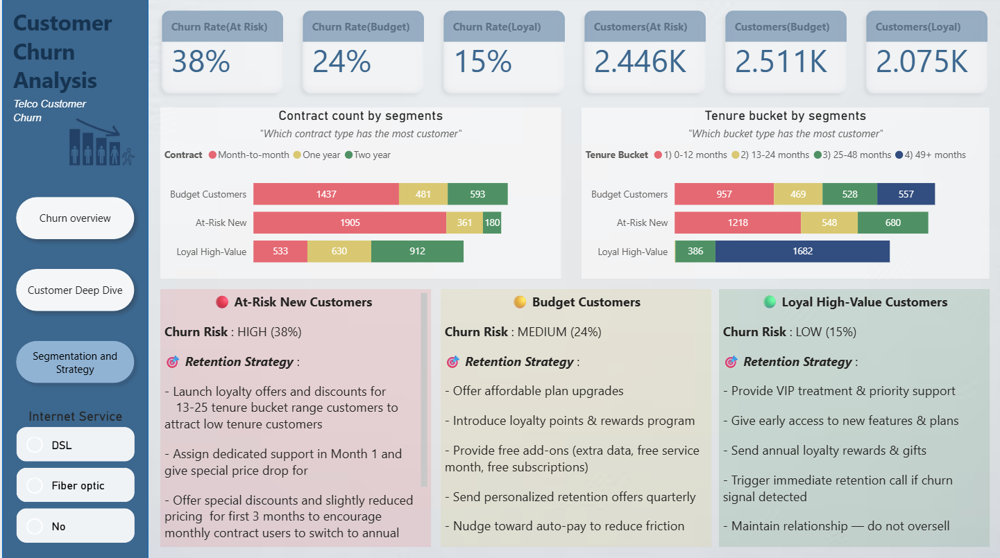

# 📉 Telco Customer Churn Prediction

A complete end-to-end machine learning project to predict customer churn in a telecom company — covering EDA, ML modelling with SHAP explainability, KMeans customer segmentation, and an interactive Power BI dashboard with actionable retention strategies.

---

## 📊 Dataset

- **Source:**
- **Size:** 7,043 customers, 33 features
- **Target:** `Churn Value` (1 = Churned, 0 = Retained)
- **Class Imbalance:** ~26.5% churn rate — handled via class weighting

---

## 🔧 Tools & Technologies

| Tool | Purpose |
|------|---------|
| Python (Pandas, Scikit-learn, XGBoost) | ML pipeline & analysis |
| SHAP | Model explainability |
| KMeans Clustering | Customer segmentation |
| Jupyter Notebook | Analysis environment |
| Power BI | Interactive dashboard |

---

## 🔍 Project Methodology

| Phase | Techniques |
|-------|------------|
| Data Cleaning | Type fixing, leakage removal, null handling |
| EDA | Distribution plots, correlation heatmap, churn drivers |
| Feature Engineering | Binary encoding, one-hot encoding, StandardScaler |
| Modelling | Logistic Regression, Random Forest, XGBoost + GridSearchCV |
| Interpretability | SHAP values, feature importance |
| Segmentation | KMeans clustering (k=3) |

---

## 📈 Dashboard Preview

### Churn Overview

> Key KPIs: 7K total customers, 2K churned, 27% churn rate, avg monthly charges of $64.80. Breakdown by payment type (electronic check leads at 45.29%), contract type (month-to-month at 42.71%), and internet service (fiber optic at 41.89%).

---

### Customer Deep Dive

> Avg tenure of churned customers is just 18 months vs 38 months for retained. Churn drops sharply with tenure — 47.68% in the first year, down to 9.51% after 49+ months. Top churn drivers from the Random Forest model: Tenure, Contract type, and Internet Service. Senior citizens churn at 41.68% vs 23.65% for non-seniors.

---

### Segmentation & Strategy

> Customers segmented into three actionable groups — **At-Risk New** (38% churn, 2.4K customers), **Budget** (24% churn, 2.5K customers), and **Loyal High-Value** (15% churn, 2K customers) — each with tailored retention strategies built directly into the dashboard.

---

## 💡 Key Insights

- **Month-to-month contracts** have a 42.71% churn rate vs just 2.85% for two-year contracts — contract upgrades are the single highest-impact retention lever
- **Fiber optic users churn at 41.89%** despite paying more — likely a service quality issue
- **Electronic check users churn the most** (45.29%) — switching to auto-pay could reduce friction and churn
- **Churn is heavily front-loaded** — nearly half of churners leave within the first 12 months
- **Top ML churn drivers:** Tenure months, contract type, internet service, dependents, and total charges (SHAP + Random Forest feature importance)
- **Attitude and competition** are the most commonly cited churn reasons by customers

---

## 👤 Author

**Kaushik Saha**
An Aspiring Data Analyst 

---

## 📄 License

Dataset sourced from Kaggle 
